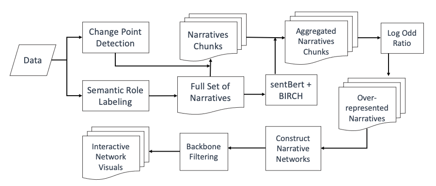

# collective_narrative_shift

A repo for accepted ICWSM2024 paper: Discovering collective narratives shifts in online discussions https://arxiv.org/abs/2307.08541

**Abstract**: Narrative is a foundation of human cognition and decision making. Because narratives play a crucial role in societal discourses and spread of misinformation and because of the pervasive use of social media, the narrative dynamics on social media can have profound societal impact. Yet, systematic and computational understanding of online narratives faces critical challenge of the scale and dynamics; how can we reliably and automatically extract narratives from massive amount of texts? How do narratives emerge, spread, and die? Here, we propose a systematic narrative discovery framework that fill this gap by combining change point detection, semantic role labeling (SRL), and automatic aggregation of narrative fragments into narrative networks. We evaluate our model with synthetic and empirical data two-Twitter corpora about COVID-19 and 2017 French Election. Results demonstrate that our approach can recover major narrative shifts that correspond to the major events.

**example results**:

---

## workflow

for detailed implementations please check Snakemake file(link...) 
